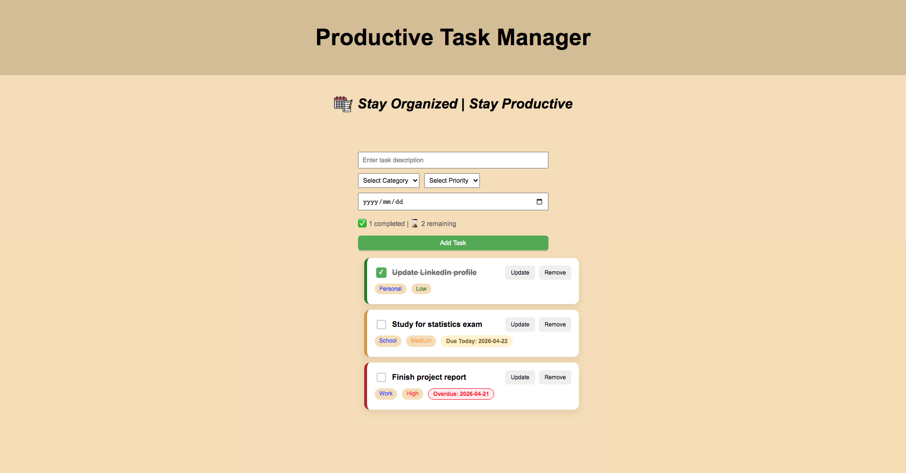

# To-do List Web Application

## 📌 Description
This project is built for **IU's** `Project: Java and Web Development (DLBCSPJWD01)` course. It is a simple **to-do list** web application with a responsive design that allows users to dynamically view, create, update, delete and track or manage tasks displayed as interactive task cards. The project uses a **Vue** frontend and a **Node.js/Express** backend.

---

## 📸 App Preview

### Main View


### Footer View


---

## 🛠️ Technologies Used
- **Frontend:** Vue.js (HTML, CSS, Javascript)
- **Backend:** Node.js and Express.js

---

## ⚙️ Prerequisites

Before running this project, make sure you have the following installed:

- **Node.js** (v16 or higher, tested on v17.9.1)
- **npm** (v8.11.0 or included with Node.js)  
- **Git** 

---

## 🚀 Installation & Setup

### 1. Clone the repository
```bash
git clone https://github.com/Abdul-Galeem/IU-DLBCSPJWD01-TodoListWebApplication.git
```

### 2. Navigate into the project folder
```bash
cd IU-DLBCSPJWD01-TodoListWebApplication
```

---

## 🖥️ Backend Setup

### 1. Go to backend folder
```bash
cd todo-list-backend
```

### 2. Install dependencies
```bash
npm install
```

### 3. Start backend server
```bash
npm start
```

The backend will run on:
http://localhost:3000

---

## 🎨 Frontend Setup

### 1. Open a new terminal
```bash
cd todo-list-frontend
```

### 2. Install dependencies
```bash
npm install
```

### 3. Run frontend
```bash
npm run dev
```

The frontend will run on:
http://localhost:5173 (or shown in terminal)

---

## 🔗 How it works
- Frontend (Vue) communicates with backend API
- Backend manages tasks (create, update, delete, fetch)
- Data is stored in memory (no database used)
